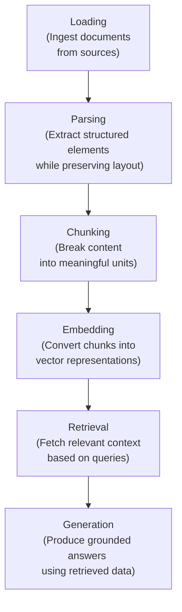

# Document Parsing for RAG: A Complete Guide for 2026
[Reference](https://www.omdena.com/blog/document-parsing-for-rag)
---
## 핵심 내용
1. RAG 성능 저하의 원인은 청킹, 임베딩, LLM모델 등이 아니라, 그보다 더 이전의 단계인 **파싱** 단계에 있다.
2. 왜? ➡️ 잘못된 문서 파싱 ➡️ 잘못된 컨텍스트를 초래 ➡️ 최종적으로 RAG 성능 저하(Hallucination, Irrelevent Responses, etc)
3. 즉, 아무리 좋은 모델, 벡터 DB, 검색 전략, 청킹 전략을 취하더라도 RAG의 가장 초기 단계인 파싱 단계에서 문제가 생기면 좋은 답변을 만들어내기 어렵다.
---
### RAG 를 위한 문서 파싱(Document Parsing)은 무엇인가?
- RAW DOCUMENT(PDF, HTML, etc) ➡️ SEMANTIC CONTENT(LLM-Ready-Data: LLM이 이해하기 쉬운 데이터)
- 일반적인 텍스트 추출과 달리, Raw Document내의 구조, 위계, 관계 등을 보존하여 추출한다는 점에서 다르다.  
---
### Document Parsing이 RAG 파이프라인을 붕괴시키는 이유는?
- 현재 RAG 시스템에서 대부분의 팀들은 RAG 성능을 개선하기 위해서 임베딩 모델, LLM 모델, VectorDB 등에 변화를 준다.
- 그러나 문서 파싱은 RAG 파이프라인에서 정보가 어떻게 들어가는지를 결정하기 때문에, 실패한 문서 파싱은 RAG 파이프라인 전체에 영향을 미친다.
- Bad parsing → Poor chunking → Weak embeddings → Irrelevant retrieval → Incorrect answers
---
### RAG 에서 다루어야하는 복잡한 문서 구조
- 모든 문서들이 단순하게 하나의 구조로 이루어지면 좋겠지만, 실제 문서들은 그렇지 않다. 아주 복잡한 구조로 이루어져있다. 이러한 이유로 **LayoutAnalysis**가 Document parsing 에서 중요한 역할을 한다.
- 이로 인해서 **Multimodal Document Parsing for RAG** 가 중요해지고 있다.
---
### 기존의 Document Parsing은 왜 실패하였을까?
- 기존의 Document Parsing Tool ➡️ PymuPDF, PDFMiner, etc
- 이러한 도구들은 문서들을 일반 텍스트로 변환(flatten documents into plain text)한다. 복잡한 문서들의 레이아웃, 열 또는 문서 내의 위계 구조 및 의미 구조를 담은 제목, 소제목 등에 대한 정보들을 **무시**한다.
- 파싱 오류 유형 정리:
  - 읽기 순서 오류: 서로 다른 열의 텍스트가 섞이는 문제
  - 계층 구조 손실: 제목과 섹션이 일반적인 텍스트로 축소됨.
  - 분할 불량: 문장 중간에서 덩어리가 분리되거나 관련없는 내용이 병합됨.
  - 시각적 잡음: 머리글, 바닥글, 페이지 번호가 본문 안으로 새어 들어옴.

- 이러한 파싱 오류들은 RAG 검색 품질을 저하시키고, 최종적으로 RAG 시스템의 성능을 저하시킵니다.
---
### Layout을 고려한(Layout-Aware) Document Parsing으로 전환
- Layout-Aware Document Parsing은 문서를 단순한 **텍스트로 다루는 것이 아닌, 시각적 요소로 취급합니다.**
- 원시 문자열을 추출하는 것이 아니라, 페이지에 정보가 어떻게 구성되어있는지 파악하고, 해당 구조를 보존하여 후속 작업에 활용합니다.

| 전통적인 구문 분석 | 레이아웃 인식 파싱 |
| :--- | :--- |
| 원문 텍스트를 추출합니다. | 구조화된 요소를 추출합니다 |
| 레이아웃을 무시합니다 | 시각적 구조를 이해합니다 |
| 읽는 순서를 깨뜨립니다 | 읽기 흐름을 유지합니다 |
| 메타데이터 없음 | 풍부한 메타데이터(페이지, 유형, 좌표) |
---

### RAG를 위한 End-To-End Document Parsing 파이프라인

---
### Layout-Aware Document Parsing의 실제 구현
- Layout-Aware Document Parsing을 실제 RAG 파이프라인에 통합할 때, 대규모로 안정적으로 구현하는 것이 다음 과제이다.
- 최신 RAG 시스템에서는 문서의 복잡성, 성능 제약 조건에 따라 기존의 Document Parser, VLM 기반의 Document Parser 들을 복합적으로 활용한다.
---
### [Reference](https://www.omdena.com/blog/document-parsing-for-rag)에서 제시하는 2026년 최고의 Document Parsing Tool

- 대부분의 기업들은 아래의 Document Parser 들을 하나만 활용하는 것이 아닌, 여러 개의 Parser들을 하이브리드하게 활용하여 복잡한 문서들을 처리하는 전략을 취한다.

| Tool | Best For | Strength | Limitation |
| :--- | :--- | :--- | :--- |
| **Unstructured** | General pipelines | Easy setup and structured output | Struggles with complex visuals and layouts |
| **LlamaParse** | Complex enterprise documents | High accuracy and strong structure preservation | Paid and API-based |
| **AWS Textract** | Forms and OCR-heavy documents | Scalable and reliable for structured extraction | Limited layout understanding |
| **Google Document AI** | Enterprise workflows | Strong OCR and document understanding capabilities | Expensive at scale |
| **Azure Document Intelligence** | Microsoft ecosystem | Seamless integrations and enterprise features | Requires post-processing for RAG use |
---
### Vision-Language Models(VLM) : 문서를 보는 모델
- 최근에는 문서를 일반적인 텍스트가 아닌 이미지로 처리하는 VLM 이 등장하고 있다.
- VLM은 시각적 단서를 활용하여 문서 내의 레이아웃, 표 혼합 컨텐츠를 추론한다. 
- 대부분의 팀들은 효율성을 위해 하이브리드 전략을 취한다. Layout-Aware Document Parser를 기본적으로 활용하되, 복잡한 문서, 표, 구조 등에 대해서는 VLM을 활용하여 효율적으로 정확도를 높이는 전략을 취한다.
---

### Multi-Column Layout에서 읽기 흐름(Reading Flow) 재구성

**Multi-Column Layout: 하나의 페이지를 가로로 길게 쓰는 것이 아니라, 세로 방향의 여러 개 구역(단)으로 나누어 콘텐츠를 배치하는 방식**

- Multi-Column 문서에서 읽기 흐름을 올바르게 구성하려면( 좌 ➡️ 우 , 위 ➡️ 아래 순서로 읽기)   
  
**Multi-Column 문서 읽기 흐름 재구성 과정** 
  - 공간 좌표를 사용하여 텍스트 블록을 클러스터링하여 관련 콘텐츠를 그룹화합니다.
  - 페이지 레이아웃 및 정렬을 기반으로 열 영역 식별
  - 자연스러운 읽기 흐름을 유지하기 위해 각 열 내에서 블록을 위에서 아래로 정렬합니다.
  - 전체 내용을 재구성하기 위해 열을 올바른 순서로 병합합니다.

### RAG 파이프라인을 위한 Intelligent Chunking
- 청킹은 파싱된 문서들을 검색이 가능한 단위로 쪼개는 것을 의미한다.
- 즉, 어떻게 청킹을 하느냐에 따라 검색되는 문서가 다르고, 검색 성능에도 영향을 미친다.

### Baseline Chunking
- 가장 기본적인 청킹은 아래와 같다.
  - 문자 또는 토큰으로 정의된 **고정 크기** 만큼 청크를 쪼갠다.
  - 청크 간의 컨텍스트가 손실되는 것을 해소하기 위해서 **슬라이딩 윈도우**를 활용한다.    

- 이러한 방법들은 빠르지만, 문서 구조를 고려하지 않기 때문에, 덩어리가 문장을 끊거나, 관련 없는 주제를 병합하거나, 제목과 내용을 분리할 수 있습니다.

### Chunking 을 "Intelligent"하게 만드는 것은 무엇일까?
- Intelligent Chunking 은 의미를 보존하기 위해서, 문서 구조와 메타 데이터를 사용하여 문서를 분할한다.
- 임의적인 분할이 아닌, 아래의 방식을 사용하여 문서를 분할함.
  - 제목, 섹션 및 단락 경계를 준수합니다.
  - 생각의 도중에 의미 단위가 분리되는 것을 방지합니다.
  - 반복되는 머리글과 바닥글을 제거합니다.
  - 콘텐츠 밀도에 따라 청크 크기를 조정합니다.
  - 페이지 번호, 섹션, 요소 유형 등의 메타데이터를 사용하여 청크를 풍부하게 만듭니다.

